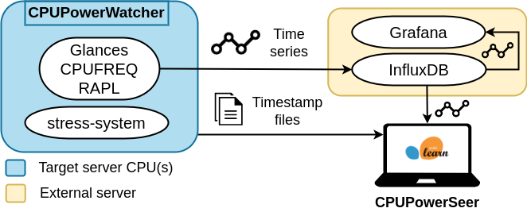

# Automated approach for CPU power modeling

This repository acts as an umbrella project for different subprojects that can be combined to automatically build CPU power consumption models. The repository includes (1) [CPUPowerWatcher](https://github.com/TomeMD/CPUPowerWatcher), which gathers CPU metrics during the execution of user-configurable workloads; and (2) [CPUPowerSeer](https://github.com/TomeMD/CPUPowerSeer), which builds models to predict CPU power consumption from different CPU variables using time series data.

<br><p align="center"></p>


## Initialization

Run `init_submodules.sh` to automatically pull and install CPUPowerWatcher and CPUPowerSeer.

## Instructions

First, run CPUPowerWatcher on the target CPU to obtain training and test datasets along with their timestamps. This tool will send the collected metrics to a time series database using InfluxDB. You can send the data to the default InfluxDB server (`montoxo.des.udc.es`) in the default bucket (`public`). Please note that your data will be deleted 30 days after storage. If you want to use your own InfluxDB server, please deploy it using the following [Docker/Apptainer image](https://github.com/TomeMD/CPUCollector/tree/master/influxdb) and remember to specify the corresponding configuration options to CPUPowerWatcher (i.e., `-i <your-influxdb-server> -b <your-influxdb-bucket>`). Timestamps will be stored by in the specified directory (`-o option`). You should run this tool at least twice before using CPUPowerSeer, in order to generate training and test datasets.

Then, run CPUPowerSeer using training and test timestamps to automatically build the models from time series data stored in InfluxDB. Note that:

- Several training datasets can be used to train the same model. To do this, copy their corresponding timestamps into a single file and pass it to CPUPowerSeer (`-t option`).

- You can evaluate models with several test datasets, CPUPowerSeer supports lists of files (`-a option`).
- If you used your own InfluxDB server while running CPUPowerWatcher, remember to specify the corresponding configuration options to CPUPowerSeer, that is, your InfluxDB server, organization and token at `CPUPowerSeer/cpu_power_seer/influxdb/influxdb_env.py` and your bucket using `-b <your-bucket>` .

## Example

You can find an execution example of these tools in `docs/example.sh`. The most important instructions in this file are explained below.

First, we run CPUPowerWatcher to get a training dataset:

```shell
./CPUPowerWatcher/run.sh -w stress-system -b public -v apptainer -o "${TRAIN_TIMESTAMPS_DIR}"
```

CPUPowerWatcher will run stress tests using our own tool `stress-system` with the default stressor `cpu` and the default stress method  `all`. Metrics will be collected by Apptainer containers and sent to the bucket `public` from InfluxDB host `montoxo.des.udc.es` (default). Timestamp files will be stored at `TRAIN_TIMESTAMPS_DIR`. 

It is important to mention that CPUPowerWatcher loads the CPU incrementally using different predefined allocations of the cores when running stress-system. Therefore, it writes a timestamp file for each core allocation. As we want to train the final model with data corresponding to all the allocations, we put all the timestamps into a single file (`all_train.timestamps`).

```shell
cat "${TRAIN_TIMESTAMPS_DIR}"/*.timestamps > "${TRAIN_TIMESTAMPS_DIR}"/all_train.timestamps
```

Now we get the test dataset:

```shell
./CPUPowerWatcher/run.sh -w npb -b public -v apptainer -o "${TEST_TIMESTAMPS_DIR}"
```

CPUPowerWatcher will run NPB kernels IS, FT, MG, CG, BT and BTIO, writing each kernel timestamps to a separated file in `TEST_TIMESTAMPS_DIR`. Then we put all the paths from test timestamp files in a list, to use it with CPUPowerSeer.

```shell
TEST_FILES=""
for TEST_FILE in $(find "${TEST_TIMESTAMPS_DIR}" -name "*.timestamps"); do
  if [ -n "${TEST_FILES}" ]; then
    TEST_FILES="${TEST_FILES},${TEST_FILE}"
  else
    TEST_FILES+="${TEST_FILE}"
  fi
done
```

Finally, we run CPUPowerSeer to automatically build the model. We indicate the model name (`example_model`), the bucket to extract the data from (`public`) and the files containing the timestamps of the training and test data. Note that the default InfluxDB host is `montoxo.des.udc.es`. The model will use a second degree polynomial regression (`polynomial`) to predict power from user usage, system usage and CPU frequency (`user_load,system_load,freq`). The results of the model will be stored in `RESULTS_DIR`.

```shell 
powerseer -n example_model -b public -t "${TRAIN_FILE}" -a "${TEST_FILES}" -p polynomial --vars user_load,system_load,freq -o "${RESULTS_DIR}"
```

This is an example of automated model building through the orchestration of these tools. It is worth noting that you could also run CPUPowerWatcher on the CPU you want to model and then run CPUPowerSeer from any other computer with access to the InfluxDB database. In addition, once the training and test datasets have been obtained, you can run CPUPowerSeer as many times as necessary to test different prediction methods (-p option) and/or variables (--vars option).

## About

This project has been developed in the [Computer Architecture Group](https://gac.udc.es/?page_id=770&lang=en) at the University of A Coruña by Tomé Maseda ([tome.maseda@udc.es](mailto:tome.maseda@udc.es)), Jonatan Enes, Roberto R. Expósito and Juan Touriño.